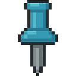
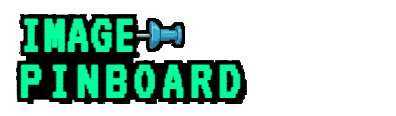
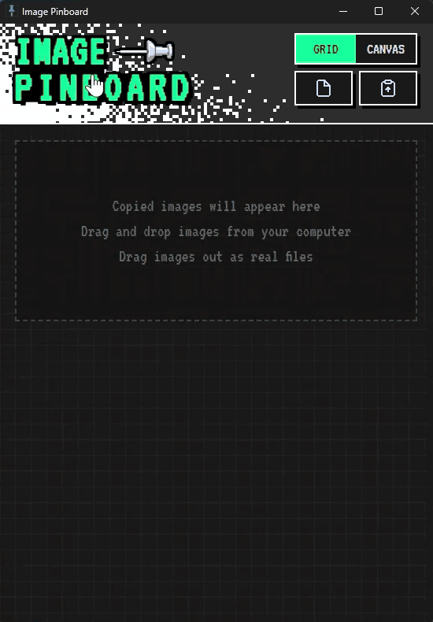

<div align="center">
  
  &nbsp;&nbsp;&nbsp;&nbsp;&nbsp;&nbsp;
  

  # Image Pinboard
  
  <p><b>A highly versatile, desktop-native workspace for managing your visual ideas and references.</b></p>
</div>

**Image Pinboard** is a lightning-fast, lightweight desktop application designed for artists, designers, and creatives who need an effortless way to gather, organize, and use reference images. Built with Rust and Tauri, it allows you to drag-and-drop images from anywhere (browsers, local folders), paste from your clipboard, draw annotations, drop sticky notes, and pin images directly above your active workspace with full opacity and click-through controls.

<div align="center">
  
</div>

## ✨ Key Features

*   **⚡ Native Drag & Drop**: Effortlessly drag images into the app from your browser or file explorer. Drag them back out directly into your other applications.
*   **📐 Infinite Canvas & Grid**: View your collection neatly stacked in a Grid, or spread them out over an infinite Canvas to build mood boards that fit your spatial thinking.
*   **📌 Always on Top & Click-Through Setup**: Pin the application to stay above your active software. Make the window fully transparent and click-through, turning references into perfect overlays for modeling or tracing.
*   **✏️ Drawing & Sticky Notes**: Annotate your boards quickly! Use your mouse to draw directly on the canvas, add customizable text sticky notes, and keep your thoughts organized right next to your images.
*   **🎨 Color Picker**: Built-in eyedropper tool allows you to pull the exact hex color codes from your images straight into your clipboard.
*   **💾 Fully Local & Private**: No cloud sync required. All your images, thumbnails, notes, and drawings are safely stored locally in a fast SQLite database.

## 🛠️ Tech Stack

This project leverages modern technologies to achieve a minimal footprint and fast execution times:

- **Frontend:** Vanilla JavaScript, HTML5, CSS3, native Canvas API
- **Backend:** [Rust](https://www.rust-lang.org/) & [Tauri](https://tauri.app/) (v2)
- **Database:** Bundled SQLite (via `rusqlite`) for quick metadata storing
- **Async & Tools:** Tokio (rate-limited local worker), reqwest (web downloading), image library for fast local thumbnail generation

## 🚀 Getting Started

### Download Pre-built Installer 📥

The easiest way to use **Image Pinboard** is to download the latest Windows installer from the [Releases page](https://github.com/mantukin/image-pinboard/releases). 

### Build from Source 🛠️

Make sure you have [Node.js](https://nodejs.org/), [Rust](https://www.rust-lang.org/tools/install), and the [Tauri CLI](https://v2.tauri.app/start/) installed.

1. Clone the repository:
   ```bash
   git clone https://github.com/mantukin/image-pinboard.git
   cd image-pinboard
   ```
2. Install frontend dependencies:
   ```bash
   npm install
   ```
3. Run the development environment:
   ```bash
   npm run dev
   ```
4. Build the production application:
   ```bash
   npm run build
   ```

## ⌨️ Controls & Workflow

- **Drag & Drop:** Bring visual elements from the web or windows.
- **Copy/Paste:** Copy an image from anywhere and press standard paste shortcut.
- **Grid View:** Good for browsing all your assets (click on any to open it).
- **Canvas View:** Middle-click (or use the tool) to **pan**, scroll out to **zoom**, and use tools from the bottom dock to brush and erase.
- **Modal Image Tweaker:** Set per-window opacity and click-through options for overlays.

---
<div align="center">
  <i>Created with ❤️ for creatives. mantukin (IPD Workshop)</i>
</div>
